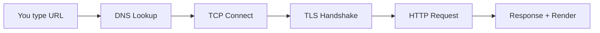
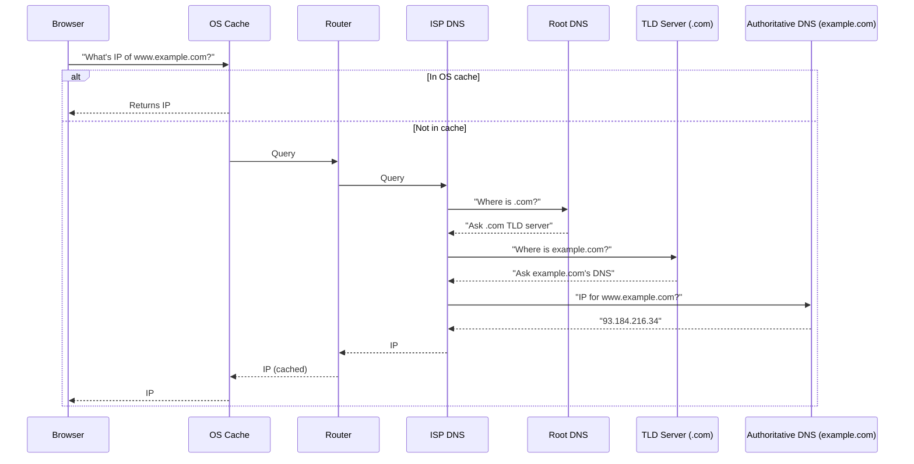
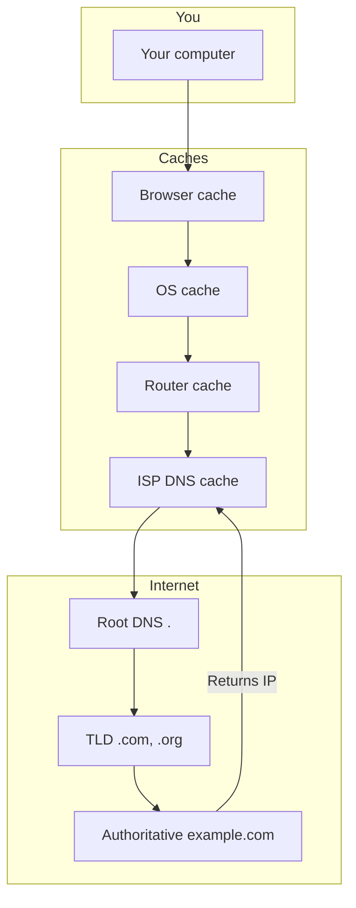
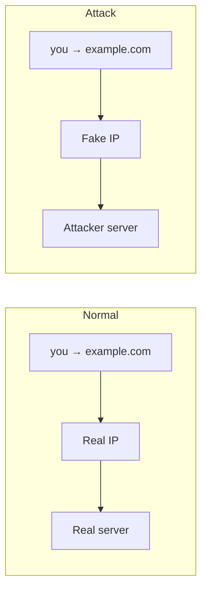
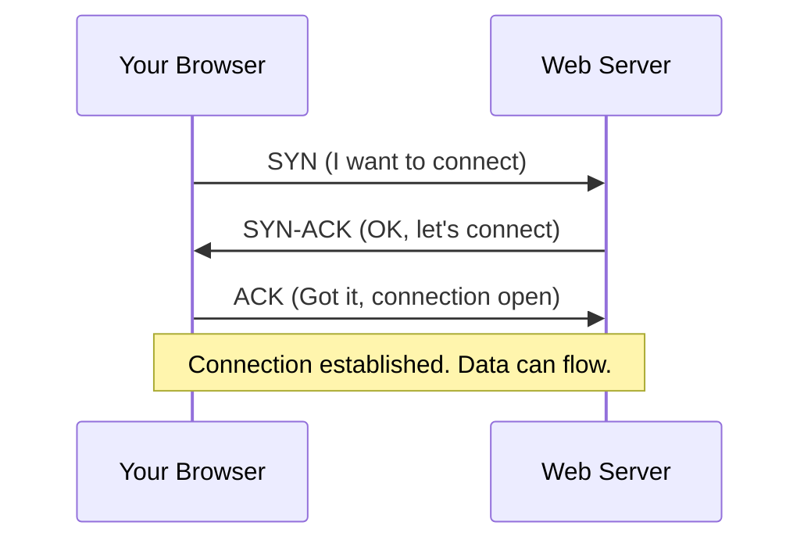
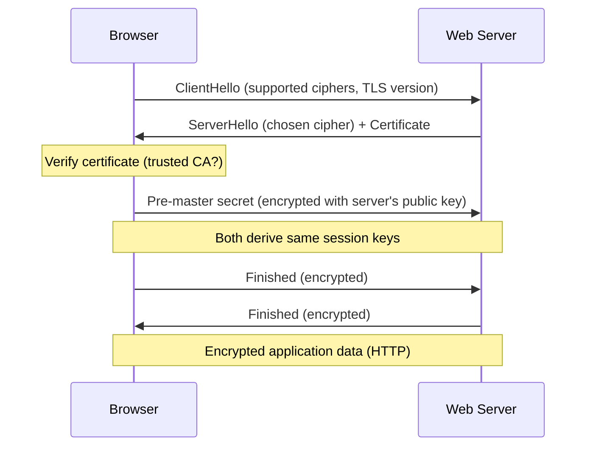
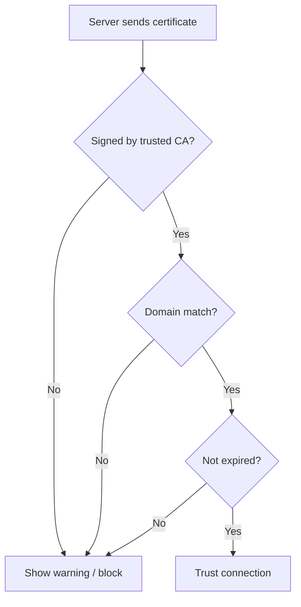
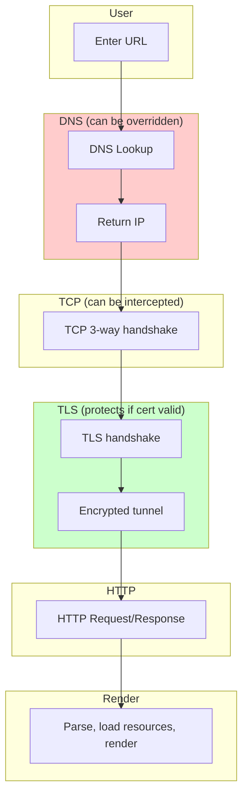

# What Happens When You Hit a URL in the Browser?

A step-by-step guide to DNS, TCP, TLS, and what happens when someone tries to override them.

> **Viewing the diagrams:** The diagrams in this doc are in [Mermaid](https://mermaid.js.org/) format. They render as flowcharts and sequence diagrams in GitHub, GitLab, VS Code/Cursor Markdown preview (with a Mermaid extension), and many note apps. If you don’t see them, open the file in one of those or use [Mermaid Live Editor](https://mermaid.live/).

---

## Table of Contents

1. [The Big Picture](#1-the-big-picture)
2. [Step 1: You Enter the URL](#2-step-1-you-enter-the-url)
3. [Step 2: DNS Lookup](#3-step-2-dns-lookup)
4. [What If Someone Overrides the IP? (DNS Attacks)](#4-what-if-someone-overrides-the-ip-dns-attacks)
5. [Step 3: TCP Connection](#5-step-3-tcp-connection)
6. [What If Someone Intercepts TCP?](#6-what-if-someone-intercepts-tcp)
7. [Step 4: TLS Handshake (HTTPS)](#7-step-4-tls-handshake-https)
8. [What If Someone Overrides or Breaks TLS?](#8-what-if-someone-overrides-or-breaks-tls)
9. [Step 5: HTTP Request & Response](#9-step-5-http-request--response)
10. [Step 6: Browser Renders the Page](#10-step-6-browser-renders-the-page)
11. [Summary Diagram](#11-summary-diagram)

---

## 1. The Big Picture

When you type `https://www.example.com` and press Enter, many things happen in order. Here's the high-level flow:

**In one sentence:** The browser finds the server's IP (DNS), opens a reliable connection (TCP), secures it (TLS), then sends an HTTP request and gets the page back.

---

## 2. Step 1: You Enter the URL

- You type something like `https://www.example.com/page`.
- The browser parses it into:
  - **Protocol:** `https` (or `http`)
  - **Host:** `www.example.com`
  - **Path:** `/page`
- The browser may check **HSTS** and **cache** to decide whether to use HTTPS and which IP to try first.

---

## 3. Step 2: DNS Lookup

The browser has a hostname (`www.example.com`) but needs an **IP address** (e.g. `93.184.216.34`) to connect. That's what DNS does.

### What is DNS?

**DNS = Domain Name System.** It's like a phone book: **domain name → IP address**.

### How DNS Lookup Works (Step by Step)

### The DNS Hierarchy

- **Root servers** know who owns **top-level domains** (.com, .org, etc.).
- **TLD servers** know who owns each **domain** (e.g. example.com).
- **Authoritative DNS** for that domain knows the **exact hostnames** (e.g. www.example.com) and returns the **IP**.

### DNS Record Types (Quick Reference)

| Type | Purpose |
|------|--------|
| **A** | Domain → IPv4 address |
| **AAAA** | Domain → IPv6 address |
| **CNAME** | Alias (e.g. www → example.com) |
| **MX** | Mail servers |
| **NS** | Name servers for the domain |

### Caching

To avoid asking the internet every time, answers are cached at:

1. **Browser** (short-lived)
2. **OS** (e.g. a few minutes)
3. **Router**
4. **ISP DNS** (longer, e.g. hours or TTL)

**TTL (Time To Live)** in the DNS response tells caches how long they can keep the answer.

---

## 4. What If Someone Overrides the IP? (DNS Attacks)

If an attacker can change **which IP** your browser gets for a domain, they can send you to **their server** instead of the real one. That's "overriding the IP."

### How the IP Can Be Overridden

Ways this can happen:

| Attack | What happens |
|--------|--------------|
| **DNS spoofing** | Attacker sends you a fake DNS reply (wrong IP) before the real one. |
| **DNS cache poisoning** | Attacker poisons a cache (router, ISP, etc.) so everyone gets the wrong IP. |
| **Compromised DNS** | Attacker controls the DNS server (e.g. hacked router, malicious ISP). |
| **Hosts file** | On your PC, `/etc/hosts` (Mac/Linux) or `C:\Windows\System32\drivers\etc\hosts` (Windows) overrides DNS. Malware can edit this. |
| **Rogue DHCP** | On local network, attacker's DHCP tells your device to use **their** DNS server, which returns fake IPs. |

### What Attacker Gains

- They can show **fake websites** (phishing).
- They can **read or modify** traffic if they also handle TLS badly (see TLS section).

### How to Reduce the Risk

- Use **DNS over HTTPS (DoH)** or **DNS over TLS (DoT)** so DNS queries are encrypted and harder to tamper with.
- Use a **trusted DNS** (e.g. Cloudflare 1.1.1.1, Google 8.8.8.8).
- **HTTPS + certificate checks** (next sections) ensure that even with a wrong IP, you're talking to the right *identity*—or the browser will warn you.

---

## 5. Step 3: TCP Connection

Once the browser has an IP (and port, usually 443 for HTTPS), it opens a **TCP** connection to the server.

### What is TCP?

**TCP = Transmission Control Protocol.** It gives:

- **Reliable** delivery (retransmits lost packets).
- **Ordered** data (bytes in the right order).
- **Connection-oriented** (explicit connect → use → close).

### TCP Three-Way Handshake

- **SYN:** "I want to start a connection."
- **SYN-ACK:** "I'm ready; here's my initial sequence number."
- **ACK:** "I got it; we're connected."

After this, both sides can send data. The connection is identified by **(source IP, source port, dest IP, dest port)**.

---

## 6. What If Someone Intercepts TCP?

TCP doesn't care about *who* is in the middle; it only cares that someone sends valid-looking SYN/ACK/ACK. So:

- **Man-in-the-middle (MITM):** Attacker sits between you and the server, forwards TCP (and later TLS/HTTP). They can read or alter data **if** they can break or bypass TLS.
- **TCP hijacking:** Attacker sends forged TCP packets (correct IPs, ports, sequence numbers) to inject or take over the stream. Hard on the modern internet (routing, firewalls), but possible on local or misconfigured networks.
- **IP override (from DNS):** If DNS was poisoned and you got the attacker's IP, your TCP connection goes **directly to the attacker**. They don't need to "intercept" TCP; they *are* the other end. Again, TLS is what protects you (or fails and shows a warning).

So: **TCP alone does not protect you.** Encryption and authentication (TLS) are what prevent an attacker from reading or safely modifying your traffic.

---

## 7. Step 4: TLS Handshake (HTTPS)

For **HTTPS**, the next step after TCP is **TLS** (Transport Layer Security). TLS does two things:

1. **Encrypt** data so eavesdroppers can't read it.
2. **Authenticate** the server so you know you're talking to the right party (and not an attacker who overrode the IP).

### TLS Handshake (Simplified)

### What's in the Certificate?

The server sends a **certificate** that includes:

- **Domain name(s)** it's valid for (e.g. example.com, www.example.com).
- **Public key** used for key exchange.
- **Signature** from a **Certificate Authority (CA)** that your browser trusts.

### How the Browser Decides to Trust

- **Trusted CA:** Browser has a list of root CAs. If the certificate chain leads to one of them and is valid, the server is considered authenticated for that domain.
- **Domain match:** The URL hostname must match the certificate's "Subject Alternative Names" (or Common Name).
- **Not expired:** Certificates have a validity period.

If any check fails, the browser shows a warning (e.g. "Your connection is not private") and may block the page.

---

## 8. What If Someone Overrides or Breaks TLS?

This is where "overriding IP" meets "overriding TCP/TLS."

### Scenario 1: Attacker Has the Wrong IP (e.g. DNS Poisoning)

- You think you're going to `example.com`, but DNS gives you the **attacker's IP**.
- Your browser opens TCP and TLS **to the attacker**.
- To make TLS "succeed," the attacker would need a **valid certificate for example.com**.
- They **cannot** get that from a public CA without controlling the domain (or breaking the CA). So:
  - **Either** TLS fails and the browser shows a certificate error (wrong host, untrusted issuer, etc.).
  - **Or** the attacker does **not** do TLS and you get no padlock / mixed content / downgrade—browsers increasingly block or warn.

So: **Overriding the IP alone doesn't override TLS** unless the attacker can also present a valid cert for that domain.

### Scenario 2: Attacker In the Middle (MITM) With a Fake Certificate

- Attacker sits between you and the real server (e.g. on your Wi‑Fi).
- They do TLS **with you** (using their own certificate) and TLS **with the server** (as a client).
- For you to see a "valid" padlock, their certificate would need to be:
  - Issued by a **CA your browser trusts**, and
  - For the **same domain** (e.g. example.com).

On a normal public network they **can't** get such a cert. So you get a **certificate warning**. If users ignore the warning and click "Proceed," then the attacker can decrypt and modify traffic. So: **TLS is only as strong as the user not ignoring warnings.**

### Scenario 3: Compromised CA or Stolen Private Key

- If a **CA is compromised** or misissues a cert for your domain, an attacker could get a "valid" certificate and do MITM without browser warnings. This is rare; CAs are audited and browsers can revoke trust.
- If the **server's private key** is stolen, the attacker can impersonate the server (they have a valid cert and the key). That's a server compromise, not "overriding" the protocol itself.

### Scenario 4: Downgrade or Weak Cipher

- **Downgrade attack:** Attacker forces client and server to use an old, weak TLS version or cipher. Modern TLS (1.2/1.3) has protections against this; old configurations are risky.
- **Weak cipher:** If a weak cipher is used, attacker might decrypt. Mitigation: disable weak ciphers and use TLS 1.2+ (prefer 1.3).

### Summary Table

| Situation | Can attacker read/change traffic? | Why / why not |
|----------|-----------------------------------|----------------|
| DNS gives attacker's IP, attacker has no valid cert | No (browser shows cert error) | Certificate won't match domain / issuer |
| DNS gives attacker's IP, attacker has valid cert | Only if they control the domain or a trusted CA | Otherwise they can't get a valid cert |
| MITM with self-signed / wrong cert | Only if user ignores warning | Browser blocks or warns |
| Compromised CA or server private key | Yes | Attacker has "legitimate" credentials |

---

## 9. Step 5: HTTP Request & Response

After TLS is up, the browser uses **HTTP/1.1** or **HTTP/2** (or HTTP/3) **over the encrypted channel**.

- **Request:** Method (GET/POST…), path, headers (Host, cookies, Accept, etc.), optional body.
- **Response:** Status (200, 404, …), headers (Content-Type, Set-Cookie, etc.), body (HTML, JSON, etc.).

For `https://www.example.com/page`:

- **GET /page** is sent over the TLS tunnel.
- Server returns HTML (and may tell the browser to load more resources: CSS, JS, images—each may trigger more DNS/TCP/TLS/HTTP as needed).

---

## 10. Step 6: Browser Renders the Page

- **Parse HTML** → DOM.
- **Load subresources** (CSS, JS, images) — each URL may go through DNS → TCP → TLS → HTTP again (or reuse connection).
- **Run JavaScript**, apply CSS, **layout** and **paint**.
- You see the page.

---

## 11. Summary Diagram

End-to-end flow and where "override" can happen:

### Takeaway

- **DNS** can be overridden (wrong IP) via poisoning, rogue DNS, or hosts file.
- **TCP** can be intercepted or you can connect to the wrong host if the IP was overridden.
- **TLS** is what protects you: it ties the connection to a **specific domain** via the certificate. If the IP was overridden, the attacker usually **cannot** present a valid cert for that domain, so the browser shows an error instead of a silent break.
- So: **always use HTTPS**, and **don't ignore certificate warnings.** That's how you stay safe even when someone overrides IP or sits in the middle of TCP.

---

## Quick Reference: Order of Operations

| Step | What happens | Attack if overridden? |
|------|----------------|------------------------|
| 1 | Parse URL | - |
| 2 | **DNS** → get IP | Yes: wrong server (until TLS checks) |
| 3 | **TCP** connect to IP:port | Yes: MITM or wrong host |
| 4 | **TLS** handshake + cert check | Fails if attacker has no valid cert |
| 5 | **HTTP** over TLS | Safe if TLS succeeded |
| 6 | Render | - |

---

*Document focus: DNS lookup, TCP, TLS, and what "override" means for IP, TCP, and TLS, with simple diagrams and security implications.*
