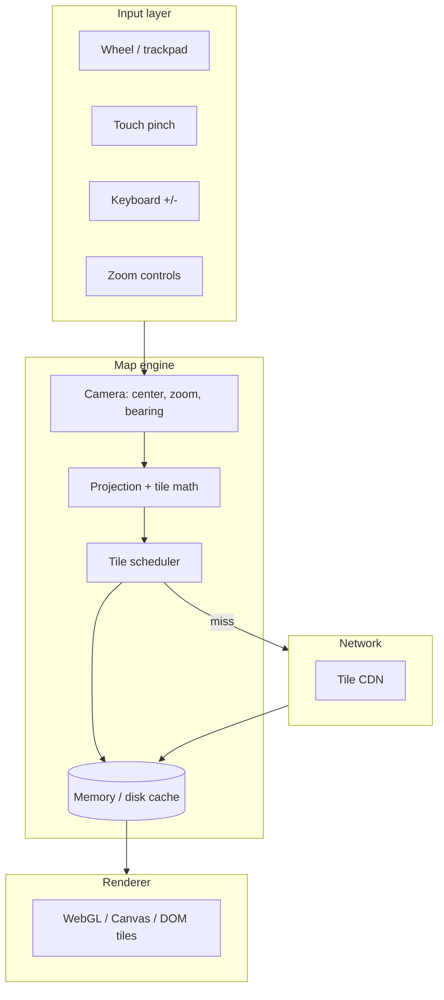

# Google Maps zoom (frontend system design)

> **Scope:** Deep dive on zoom mechanics, tile math, and gesture handling. For the full maps design question (markers, clustering, viewport scheduling), see [Q5 — Maps](./q05-maps-markers-clustering.md).

Use this doc when the prompt is **how a web map client implements smooth zoom in / zoom out**—tile loading, gestures, rendering, and perceived performance.

## One-line mental model

**Zoom** changes the map’s **scale** (meters per pixel). The browser loads **image tiles** at the right **zoom level** and **XY indices** for the visible viewport; the frontend must **request, cache, decode, and composite** tiles fast enough that pan/zoom feels continuous.

## Clarify scope in the interview

- **2D raster tiles** (classic “slippy map”) vs **vector tiles** (Mapbox-style GL) vs **hybrid** (vector base + raster overlays).
- **Platform:** web (desktop wheel + trackpad + pinch) vs mobile WebView.
- **Constraints:** offline, low bandwidth, accessibility (keyboard + screen reader), embedded iframe vs full-screen app.

## Core concept: tile pyramid

At each integer **zoom level** `z`, the world is divided into a grid of tiles (often 256×256 or 512×512 px). Tile addressing is typically **Web Mercator** with URLs like `/z/x/y.png` (exact scheme varies by provider).

| Zoom | What changes for the client |
|------|-----------------------------|
| Higher `z` | More tiles cover the same geographic area; **more network + GPU work** per frame while scaling in |
| Lower `z` | Fewer, coarser tiles; faster to fill the screen but less detail |

**Talking point:** The server does not “stream one giant image”; the client **subdivides** work into cacheable units keyed by `(z, x, y)` (and style/layer/version).

## High-level frontend architecture

## What the client computes on each zoom gesture

1. **Target zoom**  
   Clamp to min/max; optionally **smooth interpolation** (e.g. exponential scale) vs **discrete** step per integer zoom.

2. **Viewport → tile coverage**  
   From map size, device pixel ratio, center, and zoom: compute which `(x, y, z)` tiles are visible, often with a **buffer** (one ring of tiles outside the viewport) for prefetch.

3. **Prioritization**  
   - Center tiles first (what the user looks at).  
   - **Lower zoom** parent tiles as placeholders (“overscaled” tiles) while finer tiles load.  
   - Cancel or **deprioritize** requests for tiles that scrolled off-screen (avoid wasting bandwidth).

4. **Compose frame**  
   Place textures/sprites in screen space; handle **retina** (DPI) without blurry scaling when possible.

## Rendering stack (trade-offs to name)

| Approach | Pros | Cons |
|---------|------|------|
| **WebGL** (Mapbox GL, Google Maps modern web) | Smooth zoom/pitch, many layers, filters; good for **vector** | Complex; GPU memory limits; shader/worker story matters |
| **Canvas 2D** | Simpler than GL for pure rasters | Large tile counts can be CPU-bound |
| **DOM `` tiles** | Very simple | Many elements hurt layout/paint; harder for 3D/rotation |

**Interview line:** Production maps usually combine **GPU compositing**, **texture atlases** or **tile pools**, and **workers** for network parse/decode where useful.

## Gesture & interaction design

- **Wheel:** distinguish **ctrl+wheel** (browser zoom) vs map zoom; use **`passive: false`** only when you must `preventDefault`—it affects scroll jank.
- **Trackpad pinch / scroll:** map **continuous zoom** around cursor/focal point; accumulate deltas, cap velocity.
- **Double-tap / double-click:** zoom toward tap point.
- **Keyboard:** `+` / `-`, PageUp/PageDown patterns; respect **focus** and shortcuts when embedded.
- **Momentum / easing:** short animations hide network latency; offer **prefers-reduced-motion** (snap or shorter transitions).

## Network & caching (frontend-facing)

- **HTTP caching:** `Cache-Control`, ETags, immutable URLs with **content hashes** for styles.
- **Client caches:** in-memory LRU by tile key; **IndexedDB** / Cache Storage for repeat visits and offline slices.
- **Race safety:** responses for **stale** zoom/pan should not overwrite **newer** view state (associate requests with a **generation** or cancel `fetch` / ignore late replies).

## Perceived performance tactics

- Show **parent** tiles upscaled while children load (blurry → sharp transition).
- **Prefetch** likely next tiles in pan direction.
- **Decode** images off main thread when possible (WebCodecs / worker) for heavy formats.
- Cap concurrent tile downloads (e.g. **HTTP/2** multiplexing still competes for bandwidth—**6–12** concurrent tile requests is a common discussion range, tune per device).

## Failure modes & degradation

- CDN slow → keep showing **stale** tiles; mark gaps; retry with backoff.
- WebGL context lost → rebuild buffers; clear caches if needed.
- Memory pressure → evict distant zoom levels from GPU and CPU caches first.

## Accessibility checklist

- Zoom controls **visible and labeled**; keyboard paths documented.
- **Screen reader:** expose **place name / region** at new zoom, not only “zoom changed.”
- Ensure **color contrast** for roads/labels (often a separate **accessibility style** or high-contrast basemap).

## Minute summary (closing)

“A maps frontend treats zoom as **camera scale + tile pyramid addressing**. We **prioritize visible tiles**, **prefetch**, **cancel stale work**, **reuse caches**, and **composite in WebGL or Canvas** so gestures stay smooth. Vector maps shift work to **GPU tessellation and labeling**, but the **scheduling and cache** story stays the same.”
