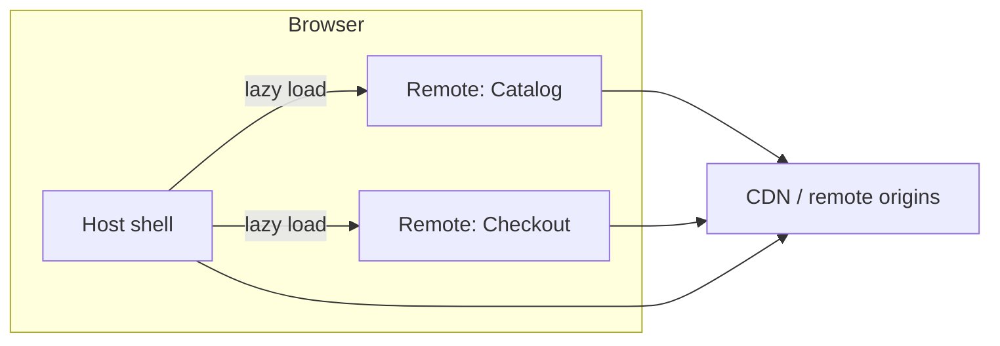

# Micro frontends (frontend system design)

Use this doc when the prompt involves **multiple teams owning different parts of the same product**, **independent deploys for UI**, or **splitting a large SPA**.

## One-line definition

A **micro frontend** composes the browser UI from **independently built and deployed** front-end applications so users still experience **one cohesive product**, usually via a **host shell** that loads **remote** bundles or documents.

## When it helps (say this in the interview)

- Several teams ship UI on different cadences; a single SPA creates **bottlenecks** (build time, merge conflicts, release train).
- You want **clear ownership** per business domain (e.g. Catalog vs Checkout).
- You need **incremental migration** from a legacy stack without a big-bang rewrite.

## When to avoid

- **One small team**, one product surface → a **modular monolith** (feature folders, lazy routes, shared design tokens) is often enough.
- Heavy **shared state** across everything → micro frontends add **contract and versioning** pain; boundary design must be explicit.

## Integration patterns (know the names)

| Pattern | Idea | Trade-off |
|---------|------|-----------|
| **Build-time packages** | UI published as npm packages; host bundles them. | Simpler ops; host must **rebuild** to pick up remote changes. |
| **Runtime module federation** (e.g. Webpack 5) | Host loads remote **entry JS from URL** at runtime. | True independent deploy; need **version/sharing** discipline for shared libs (e.g. one React instance). |
| **iframes** | Each app is its own document. | Strong isolation; harder **seamless UX**, routing, and performance tuning. |
| **Web Components** | Encapsulated custom elements; shell is framework-agnostic. | Good for long-lived platforms and mixed stacks; learning curve. |
| **Reverse proxy / path-based** | e.g. `/catalog/*` → service A, `/account/*` → service B; shell ties navigation. | Often combined with federation or MPA-style loads. |

## Small example: e-commerce portal (2-minute story)

**Teams:** Team A owns **Catalog**, Team B owns **Checkout**.

1. **Host (shell)**  
   - Owns: chrome (header, nav), **authentication/session**, top-level **router**, design tokens.  
   - Routes: `/catalog/*` → load Catalog remote; `/checkout/*` → load Checkout remote.

2. **Catalog remote**  
   - Deployed to its own CDN origin or path.  
   - Exposes a bootstrap entry the host mounts (e.g. `CatalogApp`).

3. **Checkout remote**  
   - Same pattern; separate deploy pipeline.

4. **Contract between shell and remotes**  
   - **Routing:** shell owns browser history; remotes use a agreed **base path**.  
   - **Auth:** cookie/session or token passed via shell context—**no duplicate login**.  
   - **Cross-slice events:** thin channel (custom events, tiny event bus, or callback props)—avoid a fat shared global store.

5. **User flow**  
   User opens `app.example.com` → shell loads → navigates to catalog (lazy remote) → proceeds to checkout (second remote). URL and session stay consistent.

**Architecture sketch (describe or whiteboard):**



## Design decisions interviewers dig into

- **Routing and deep links:** refresh and back button must work; shell coordinates **404** vs remote **not found**.
- **Dependency sharing:** align React/Vue versions or use federation **shared** config to avoid **duplicate runtime** and bundle bloat.
- **Styling:** shared **design system** package (versioned); scoped CSS or tokens to prevent collisions.
- **Testing:** contract tests for shell–remote integration; E2E on critical cross-remote flows.
- **Versioning:** remotes stay **backward compatible** with the shell for a window, or use feature flags for coordinated rollouts.
- **Failure isolation:** if a remote fails to load, shell shows **fallback UI** and logs; optional retry or stale cached bundle policy.
- **Performance:** per-remote code splitting, CDN caching, avoid loading all remotes on first paint.

## If they ask: “How would you implement?”

In the interview you rarely write a full repo—show you know **build config**, **runtime loading**, **shared dependency rules**, and **how the shell mounts remotes**. Below are **minimal, realistic sketches** you can explain on a whiteboard or live code snippet.

### 1. Webpack 5 Module Federation (most common “real” answer)

**Remote** (Catalog app deployed to its own URL) declares what it **exposes** and shares React as a **singleton** so the host does not load two copies.

```js
// catalog/webpack.config.js (remote) — illustrative
const { ModuleFederationPlugin } = require('webpack').container;

module.exports = {
  plugins: [
    new ModuleFederationPlugin({
      name: 'catalog',
      filename: 'remoteEntry.js',
      exposes: {
        './CatalogApp': './src/CatalogApp.tsx',
      },
      shared: {
        react: { singleton: true, requiredVersion: false },
        'react-dom': { singleton: true, requiredVersion: false },
      },
    }),
  ],
};
```

**Host** declares **remotes** pointing at the deployed `remoteEntry.js` (often **env-specific** URL: dev/staging/prod).

```js
// shell/webpack.config.js (host) — illustrative
const { ModuleFederationPlugin } = require('webpack').container;

module.exports = {
  plugins: [
    new ModuleFederationPlugin({
      name: 'shell',
      remotes: {
        catalog: `catalog@${process.env.CATALOG_CDN_URL}/remoteEntry.js`,
        checkout: `checkout@${process.env.CHECKOUT_CDN_URL}/remoteEntry.js`,
      },
      shared: {
        react: { singleton: true, requiredVersion: false },
        'react-dom': { singleton: true, requiredVersion: false },
      },
    }),
  ],
};
```

**Host app** loads the remote like a normal dynamic chunk (names must match `exposes`):

```tsx
// shell: lazy-load remote as if it were a local module
import React, { Suspense } from 'react';

const CatalogApp = React.lazy(() => import('catalog/CatalogApp'));

export function CatalogRoute() {
  return (
    <Suspense fallback={<div>Loading catalog…</div>}>
      <CatalogApp />
    </Suspense>
  );
}
```

**Talking points:** `remoteEntry.js` is the **manifest** the browser fetches at runtime; **singleton shared** deps avoid duplicate React; **version skew** is managed by pinning compatible ranges or **feature flags**; CDN should **cache** hashed chunks aggressively but **version** `remoteEntry` URL or filename on breaking changes.

**Alternatives you can name:** **Rspack** / **Module Federation v2** (similar ideas), **Vite** via `@module-federation/vite` or community federation plugins—concept is the same: **exposes/remotes + shared**.

---

### 2. Build-time package (npm) + lazy route in the host

No runtime `remoteEntry`; the host **bundles** the feature at build time. Good when remotes release less often or you accept coupling.

```tsx
// Host depends on @acme/catalog-ui in package.json
import React, { lazy, Suspense } from 'react';

const CatalogApp = lazy(() => import('@acme/catalog-ui'));

export function CatalogRoute() {
  return (
    <Suspense fallback={null}>
      <CatalogApp />
    </Suspense>
  );
}
```

**Talking points:** CI publishes `@acme/catalog-ui`; host bumps version and redeploys; **simpler ops**, **less** true decoupling than federation.

---

### 3. iframe + `postMessage` (isolation-first)

Useful for **third-party** or **legacy** apps where you need a hard boundary.

```html
<!-- Shell mounts a remote document -->
<iframe
  id="catalog-frame"
  title="Catalog"
  src="https://catalog.example.com/embed"
/>
```

```js
// Shell → remote (contract: message shape is your API)
const frame = document.getElementById('catalog-frame');
frame.contentWindow.postMessage(
  { type: 'AUTH', payload: { token: '…' } },
  'https://catalog.example.com'
);

window.addEventListener('message', (event) => {
  if (event.origin !== 'https://catalog.example.com') return;
  if (event.data?.type === 'NAVIGATE') {
    // Shell updates top-level router, e.g. /checkout
  }
});
```

**Talking points:** **strict origin checks**; UX limits (focus, height auto-resize hacks); good when **security / blast radius** matters more than seamless SPA feel.

---

### 4. Meta-framework routing (shell owns the URL)

Example: **React Router** in the shell; remotes render **under** a path. Remotes should not call `history.push` with absolute app root unless coordinated—prefer **relative** navigation or callbacks up to the shell.

```tsx
// Shell routes (conceptual)
<Routes>
  <Route path="/" element={<Home />} />
  <Route path="/catalog/*" element={<CatalogRemoteMount />} />
  <Route path="/checkout/*" element={<CheckoutRemoteMount />} />
</Routes>
```

`CatalogRemoteMount` is where you put `React.lazy` + federation import or an iframe. The `/*` passes **subpaths** to the remote if it has internal routes.

---

### 5. Orchestration libraries (name-drop only unless you know them)

- **single-spa**: register apps by route, each app can be React/Vue/Angular; **import maps** or SystemJS historically used to load bundles.
- **qiankun** (popular in some regions): similar lifecycle, often with **sandboxed** styles/scripts.

**Sound bite:** “We’d either use **first-class federation** in webpack/vite or a **meta-framework** like single-spa if we need **multi-framework** lifecycles and a single registration layer.”

---

### 6. What “done” looks like in production (checklist)

| Piece | Example |
|-------|---------|
| Deploy | Remote → static host or object storage + CDN; **immutable** hashed assets |
| Config | Host reads remote URLs from **env** or **config service** |
| Auth | **HttpOnly cookie** (BFF) or shell passes **read-only context**; avoid duplicating token storage in every remote |
| Errors | `Suspense` / error boundary around each remote; **retry** load of `remoteEntry` |
| Observability | One **RUM** vendor in shell; remotes use same trace / user id if possible |

## Trade-offs (structured for interviews)

### Micro frontends vs a modular monolith

| Dimension | Modular monolith (single SPA, feature modules) | Micro frontends |
|-----------|-----------------------------------------------|-----------------|
| **Team autonomy** | Shared release train; boundaries are **conventional** (folders, ownership docs) | **Independent** deploys and pipelines per slice |
| **Consistency** | Easier **one** design system and one router | Risk of **visual drift** and duplicated patterns without strong governance |
| **Operational surface** | One build, one CDN artifact, simpler on-call | **Many** deployables, version skew shell ↔ remotes, more failure modes |
| **Runtime performance** | One graph of chunks; shared deps **trivial** | Must **share** React/etc. correctly or pay duplicate download + hook bugs |
| **Best when** | One product, few teams, fast iteration on shared codebase | Many teams, domains with **different cadences**, or incremental **migration** |

Neither is “better”—interviewers want **criteria**: team topology, release pressure, UX bar, and migration context.

---

### Trade-offs by integration pattern

| Pattern | You gain | You give up |
|---------|----------|-------------|
| **Runtime federation** | True decouple of deploys; load remotes **on demand** | Build/tooling complexity; **contract** testing; cache/`remoteEntry` versioning discipline |
| **Build-time npm packages** | Simple mental model; typecheck across packages in monorepo | Host must **rebuild** to pick up remote UI changes; weaker “true” autonomy |
| **iframe** | Maximum **isolation** (JS/CSS/global scope); good for untrusted or legacy | Weak **seamless** UX, awkward sizing/focus, **postMessage** API to maintain |
| **Web Components** | Framework-neutral shell; encapsulation via shadow DOM | Heavier **interop** story with React state/tools; team skills curve |
| **Orchestrator (single-spa, qiankun)** | Explicit **mount/unmount** lifecycles; multi-framework in one shell | Extra layer to learn; still need a loading and **routing** story underneath |

---

### Dimensional trade-offs (drill-down)

**Organization and velocity**

- **Pro:** Teams ship without blocking on a central front-end gate; clearer **ownership** and on-call per domain.
- **Con:** Need **interfaces** (routing, auth, events)—otherwise you get implicit coupling and meetings instead of code coupling.

**User experience and product coherence**

- **Pro:** Each domain can optimize its flows.
- **Con:** Inconsistent loading states, spacing, and patterns unless you enforce a **design system**, tokens, and shared primitives; **global** concerns (toasts, modals, focus management) are easy to get wrong across boundaries.

**Performance**

- **Pro:** Code-split by domain; users may not download unused remotes.
- **Con:** **Waterfalls** if shell waits on remote config missing; **multiple** loads of the same library if `shared`/singleton is misconfigured; harder to reason about total **JS budget** across teams.

**Security**

- **Pro:** iframes/sandbox can **contain** a less trusted remote.
- **Con:** More surfaces for **XSS** if remotes mishandle user content; **postMessage** without strict `origin` checks is risky; token patterns must be **consistent** (avoid each team inventing storage).

**Developer experience**

- **Pro:** Smaller repos per team; CI runs only for what changed (in polyrepo setups).
- **Con:** **Local dev** may require running shell + N remotes or mocks; **debugging** across bundles; onboarding “how do I run the whole app?” gets harder.

**Reliability and operations**

- **Pro:** Blast radius can be **smaller** if one remote fails and shell handles it.
- **Con:** **Partial outages** (remote CDN down, bad deploy) need **fallback UI**, retries, and monitoring **per** remote; harder **end-to-end** ownership stories without platform standards.

---

### What to say when they ask “so would you always use micro frontends?”

> “No. I’d default to a **well-boundaried monolith** until **organizational scale** or **release independence** clearly outweighs the **operational and consistency** cost. If we adopt micro frontends, I’d invest in a **shell**, **design system**, **shared dependency policy**, and **contract tests** up front—that’s where the hidden cost usually lives.”

## Closing sound bite

> “We use a **host shell** for shared concerns and routing, and **compose domain UIs as remotes**—often **runtime federation**—with a **small, stable contract** for auth and navigation. That gives **independent deploys** while the user sees **one application**.”
